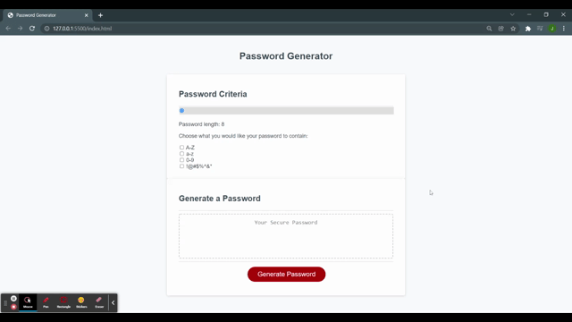

# Simplified Javascript Password Generator

The purpose of this project is to create a password generator using what I've learnt in Week 03 through The Coding Bootcamp by University of Sydney and Trilogy Education.

## Why build this project?

We spend about 10 hours learning about Javascript in a classroom environment. However, this is not enough time to fully grasp Javascript fundamamentals and what it takes to work like a real-world developer.

Using the acquired knowledge takes repititions, effort and time to master, even then there is always something new to learn -- it has also been a fun and enjoyable task.

## What's the user story?

The user is an employee with access to sensitive data. They want to randomly generate a password that meets a certain criteria so that they can create a strong password that provides greater security.

## What I've learnt?

- Different ways of working with arrays
- How to use and experiment with conditional statements i.e. *if* statement, *For Loop* etc.
- Object-oriented Javascript (OOJS)
- Basic DOM manipulation

## Demo

### Disclaimer

This password generator is not recommended for real-world applications. Javascript "random" is not truly random and can be predictable.